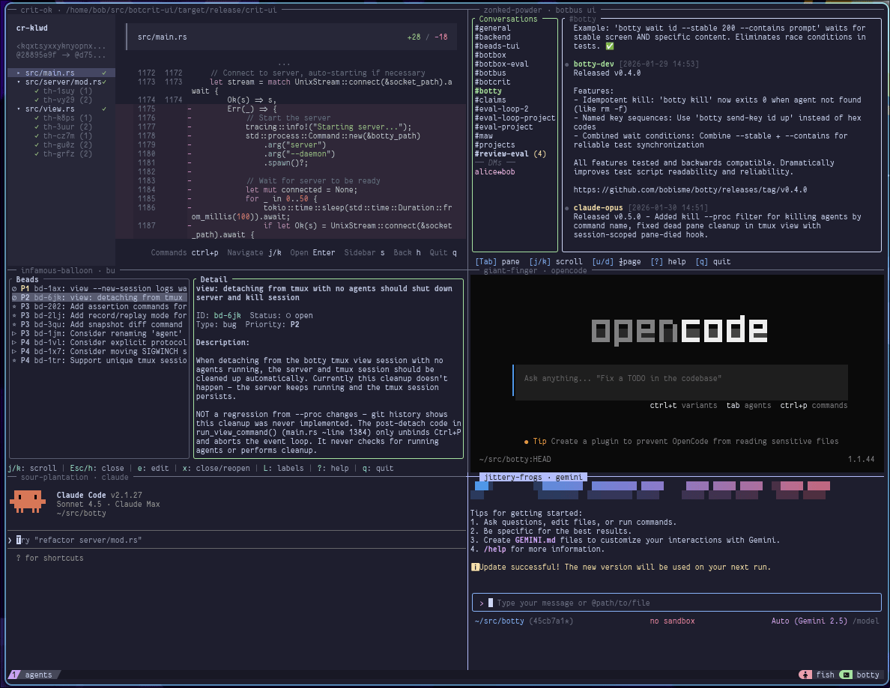

# botty

A PTY-based agent runtime for spawning, managing, and observing terminal
processes over a Unix socket.

**For:** AI agent orchestrators, test harnesses, and automation tools that need
to control interactive terminal programs programmatically.
**Not for:** general-purpose process supervisors or container runtimes.

## Screenshot



## Commands

```bash
# Spawn an agent and interact with it
botty spawn --name my-shell -- bash
botty send my-shell "echo hello"
botty snapshot my-shell

# Kill agents by name, label, or command
botty kill my-shell
botty kill --label batch-1
botty kill --proc htop

# Watch everything in a tmux dashboard
botty view
```

## Status

**Beta.** API is stabilizing but may change between minor versions. Linux only.
The server auto-starts on first use and communicates over a Unix socket
(`$XDG_RUNTIME_DIR/botty/botty.sock` by default).

## Non-Goals

- **Not a container runtime.** No cgroups, namespaces, or resource isolation
  beyond PTY boundaries.
- **Not a job scheduler.** No cron, retry policies, or persistent queues.
- **Not cross-platform.** Unix sockets and PTYs are Linux/macOS only.

## Mental Model

```
Agent    = PTY process + virtual screen + transcript buffer
Server   = owns all agents, listens on Unix socket, manages lifecycle
Client   = stateless CLI that sends JSON requests over the socket
View     = tmux session with one pane per agent (attach --readonly)
```

- Agents are addressed by ID (auto-generated or `--name`).
- Labels group agents for bulk operations (`--label worker`).
- The server auto-starts on first client request and persists until `botty shutdown`.
- Signals go through `agent.pty.signal()` — botty never kills arbitrary PIDs.

## Install

```bash
cargo install --locked --git https://github.com/bobisme/botty --tag v0.5.0
```

Requires Rust 1.85+ (uses `let-else` and `let chains`).

## Quick Start

```bash
# Spawn an interactive shell
botty spawn --name demo -- bash

# Send a command and read the screen
botty send demo "ls -la"
botty snapshot demo

# Attach interactively (Ctrl+G then d to detach)
botty attach demo

# Clean up
botty kill demo
```

## Usage

### Spawning agents

```bash
botty spawn -- htop                          # auto-generated name
botty spawn --name worker -- python app.py   # custom name
botty spawn --label batch --timeout 60 -- make test  # labels + auto-kill
```

### Observing

```bash
botty list                    # running agents (toon format for LLMs)
botty list --format json      # JSON output
botty snapshot <id>           # current screen contents
botty tail <id>               # last N lines of transcript
botty tail <id> --follow      # stream output
```

### Killing

```bash
botty kill <id>               # kill by ID (SIGKILL)
botty kill --label batch      # kill all agents with label
botty kill --proc htop        # kill agents whose command matches "htop"
botty kill --all              # kill everything
botty kill <id> --term        # SIGTERM instead of SIGKILL
```

### Waiting

```bash
botty wait <id> --contains "ready"           # wait for string in output
botty wait <id> --stable 200                 # wait for screen to settle
botty wait <id> --contains "$ " --stable 100 # combined (AND logic)
```

### Orchestration

```bash
# Dependency chains
botty spawn --name db -- postgres
botty spawn --name app --after db --wait-for db:ready -- node server.js

# Event stream for reactive automation
botty events --output   # JSON stream of spawn/exit/output events
```

### View (tmux dashboard)

```bash
botty view                    # launch tmux viewer
botty view --mode windows     # one tmux window per agent
botty view --label frontend   # filter by label
```

Press **Ctrl+P** for the command palette inside the viewer.

## Configuration

| Setting | Default | Description |
|---------|---------|-------------|
| `BOTTY_SOCKET` | `$XDG_RUNTIME_DIR/botty/botty.sock` | Unix socket path |
| `--verbose` / `-v` | off | Debug logging to stderr |

## Diagnostics

```bash
botty doctor   # checks socket, PTY allocation, server connectivity, spawn/kill cycle
```

Healthy output: all checks show `[OK]`. If the server is unresponsive, try
`botty shutdown` to clear a stale socket, then retry.

## For AI Agents

- All commands are non-interactive (except `attach`) and return structured output.
- `--format json` on `list` gives machine-parseable agent state.
- `snapshot` returns the current virtual screen — no terminal emulator needed.
- `wait` blocks until output conditions are met (avoids polling).
- `events` provides a JSON stream for reactive orchestration.
- `exec` is a convenience wrapper: spawn + send + wait + snapshot + kill.
- Kill is idempotent — killing a non-existent agent exits 0.

## References

- [CLAUDE.md](CLAUDE.md) — development workflow, testing strategy, commit conventions
